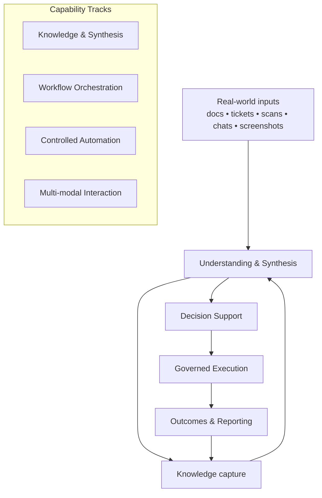
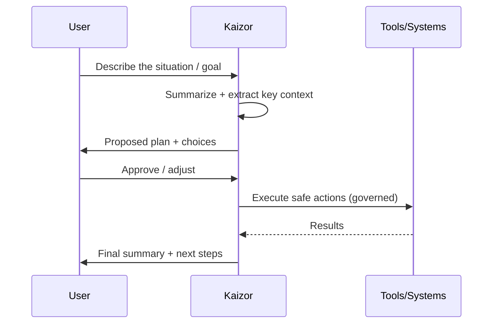
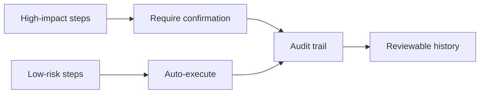
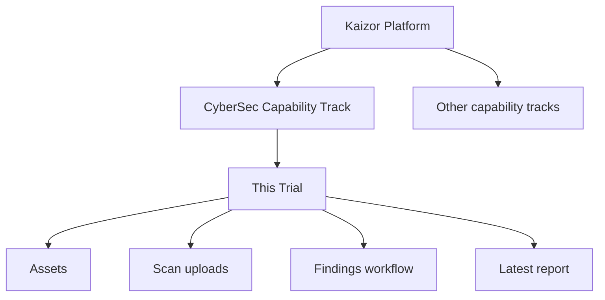

# Kaizor Platform — Visual Diagrams

These diagrams are documentation-only and contain **no source code**.

## 1) Platform map (capability tracks)

## 2) From problem to outcome (human-in-the-loop)

## 3) Governance model (trust boundaries)

## 4) Where the Trial fits (one capability track)

