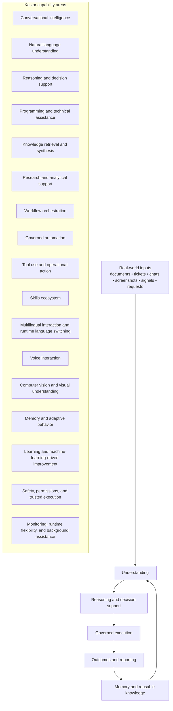
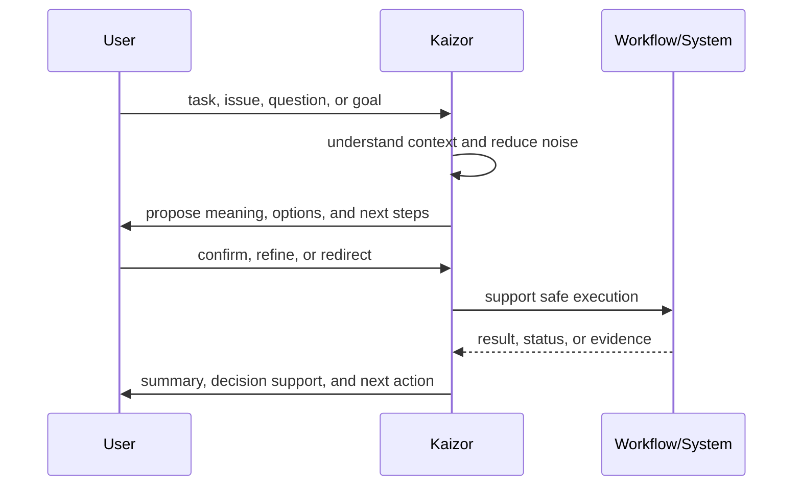
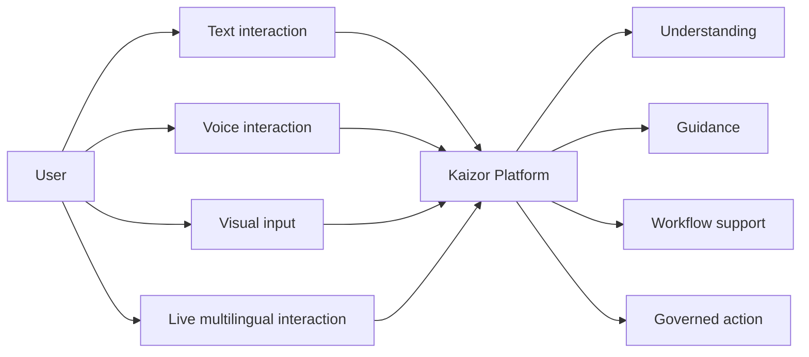
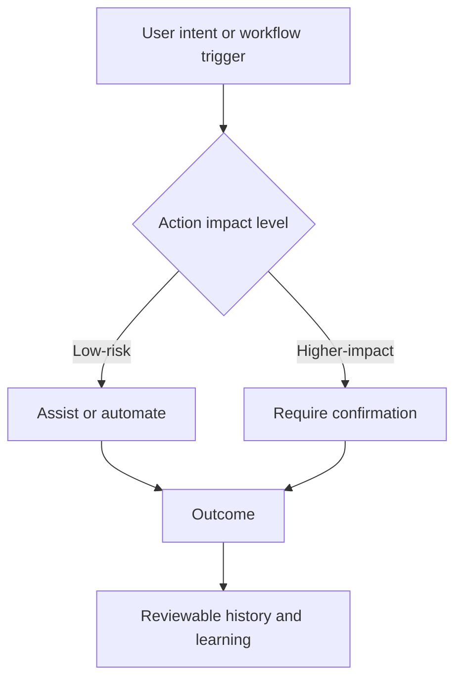
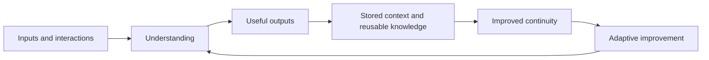
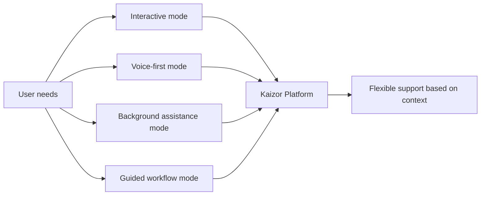
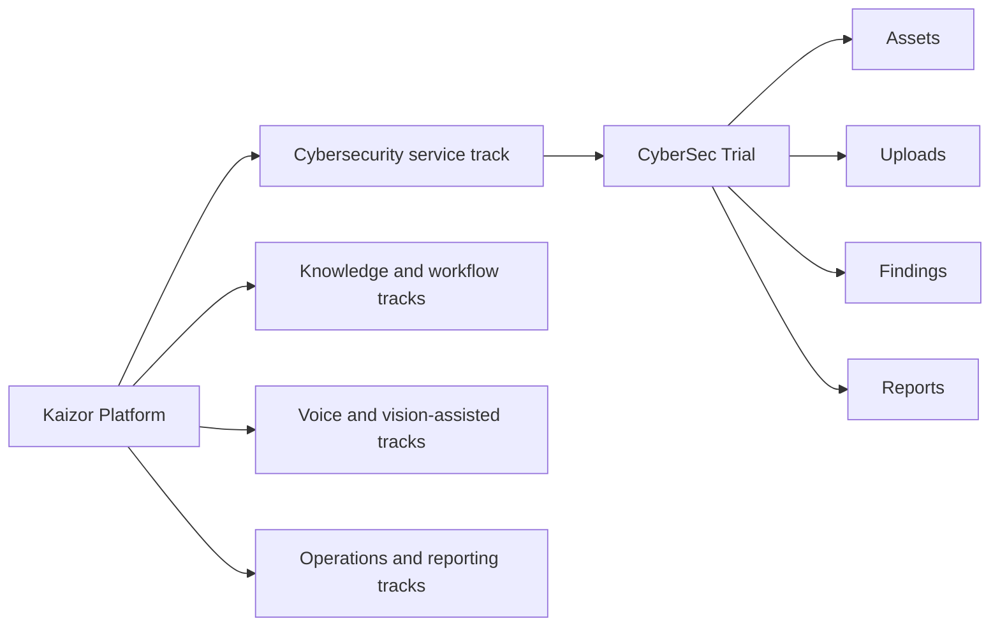

# 🚀 Kaizor Platform

Kaizor is a general AI platform built to solve a very human problem:
**modern work is overloaded with information, fragmented across tools, and slowed down by repetition, uncertainty, and broken context.**

Most organizations are not struggling because they lack software.
They are struggling because the software they already have does not think with them, does not preserve context, and does not reduce the friction between understanding, decision-making, and action.

Kaizor is designed to close that gap.

It brings together intelligence, workflow support, governed automation, memory, voice, and visual understanding into one platform experience that can serve many real-world use cases.

## ⚡ The real-world problems Kaizor solves

### 1) Context is everywhere, but usable clarity is nowhere
Critical information is spread across documents, conversations, dashboards, screenshots, reports, tickets, notes, and human memory.

Teams often spend more time reconstructing context than actually solving the problem in front of them.

**Kaizor helps by** turning scattered inputs into a usable operating context: what matters, what changed, what needs attention, and what should happen next.

### 2) Teams drown in noise, not in lack of data
Many organizations already have more data than they can interpret:
- too many messages
- too many updates
- too many alerts
- too many documents
- too many repeated requests

**Kaizor helps by** reducing noise into structured understanding: summaries, priorities, guidance, and next-step visibility.

### 3) Repetition quietly destroys productivity
The same tasks repeat every day:
- searching for the same answers
- rewriting the same updates
- following the same operational steps
- triaging the same categories of issues
- explaining the same decisions over and over again

**Kaizor helps by** reducing repetitive low-value effort and making repeatable work easier, faster, and more consistent.

### 4) Decisions are slow because confidence is low
People hesitate when they do not have enough context, do not trust the information, or are unsure whether an automated action is safe.

**Kaizor helps by** creating a guided path from understanding to decision, with support for safe execution and human confirmation where needed.

### 5) Institutional knowledge keeps leaking
When knowledge stays trapped in people, handoffs, and old conversations, organizations repeat avoidable mistakes.

**Kaizor helps by** preserving patterns, capturing context, and making prior knowledge easier to reuse instead of rediscover.

### 6) Automation often fails because it is either too weak or too reckless
Weak automation creates little value. Reckless automation destroys trust.

**Kaizor helps by** enabling governed automation: useful where it should be helpful, careful where it should be controlled.

## 🧠 Full capability map

Kaizor is not a single-purpose application. It is a broad AI platform with multiple capability layers that can be combined based on the workflow, domain, and level of operational maturity.

Some of these capabilities are already visible in practical workflows today.
Others represent the natural expansion path of the platform as it matures into a wider operational AI system.

### Conversational intelligence
Kaizor supports natural interaction that feels closer to working with a capable operational partner than a static interface.

This includes:
- understanding requests and intent
- handling back-and-forth interaction
- guiding users through tasks
- helping users move from question to decision

### Reasoning and decision support
Kaizor is built to help users think through complexity instead of merely presenting raw outputs.

This includes:
- turning ambiguity into structured options
- helping compare paths and tradeoffs
- suggesting next actions based on context
- reducing hesitation in real operational flows

### Natural language understanding and intent handling
Kaizor is designed to recognize what the user actually wants, not just react to keywords.

This includes:
- interpreting intent across different phrasing styles
- handling task-oriented and conversational requests
- routing the request toward the most appropriate capability path
- reducing the friction between expression and useful action

### Knowledge retrieval and grounded answers
Kaizor is built not only to “sound smart”, but to remain useful when answers need stronger grounding in available knowledge.

This includes:
- retrieving relevant context from available knowledge sources
- grounding outputs in reusable information instead of isolated guesses
- reducing repeated searching across documents and prior material
- helping organizations turn knowledge into an operational asset

### Programming and technical assistance
Kaizor can support technical thinking and software-oriented work where people need more than generic chat.

This includes:
- helping break down technical problems
- assisting with implementation thinking and solution paths
- supporting debugging-oriented reasoning
- helping teams move faster through engineering-heavy workflows

This matters because a large part of modern work is now software-shaped, even outside pure engineering teams.

### Knowledge understanding and retrieval
Kaizor can work with large bodies of information and make them easier to use in practice.

This includes:
- summarizing long content
- extracting key facts, risks, and action points
- surfacing relevant knowledge at the right time
- reducing time lost to searching and re-reading

### Research and analytical support
Kaizor can help transform scattered information into structured insight.

This includes:
- comparing options and perspectives
- identifying patterns across multiple inputs
- building concise analytical summaries
- reducing the effort required to turn information into usable judgment

### Workflow orchestration
Kaizor is designed for real work, not just isolated prompts.

This includes:
- guiding multi-step workflows
- maintaining continuity between steps
- keeping decisions attached to actions
- reducing broken handoffs between people and systems

### Governed automation
Kaizor supports automation with trust boundaries.

This includes:
- helping automate repetitive low-risk steps
- introducing approval where impact is higher
- making actions more visible and reviewable
- enabling safer adoption in organizational settings

### Tool use and operational action
Kaizor is positioned to work not only as an “answering layer” but also as an action-oriented layer.

This includes:
- interacting with connected tools and systems
- moving from suggestion to assisted execution
- supporting repeatable operational actions
- helping organizations bridge the gap between insight and follow-through

### Skills ecosystem
Kaizor is designed as a capability platform, meaning it can be extended across many task types and service tracks.

This includes:
- focused operational skills
- domain-specific workflows
- expandable capability packs
- the ability to support very different use cases without losing platform coherence

This is one of Kaizor’s structural strengths: it can grow as a platform by adding capabilities without losing its core identity.

### General-purpose adaptability
Kaizor is designed to be useful across different contexts rather than trapped inside one narrow category.

This includes:
- adapting to business, operational, technical, and analytical workflows
- supporting both specialist and cross-functional use
- serving as a platform foundation for many future service tracks

### Multilingual interaction
Kaizor is designed for environments where language flexibility matters.

This includes:
- multilingual interaction patterns
- reduced dependency on one working language
- smoother user experience for mixed-language teams

### Runtime language switching
Kaizor is positioned to support dynamic language behavior during live interaction rather than forcing users into a fixed language mode.

This matters in real teams where users naturally move between languages depending on context, audience, or task.

### Voice interaction
Kaizor can support voice-first or voice-assisted usage where typing is inefficient or unnatural.

This includes:
- spoken interaction
- hands-busy workflow support
- more accessible interaction for broader user groups

### Computer vision and visual understanding
Kaizor is not limited to text.
It can participate in workflows where visual inputs matter.

This includes:
- understanding visual scenes
- interpreting screenshots and interface states
- describing, classifying, tracking, and structurally interpreting visual context
- using visual evidence as part of a broader workflow

This is important because many real-world workflows depend on what people see, not just what they type.

### Memory and adaptive behavior
Kaizor is designed to become more helpful over time by preserving continuity across interactions and workflows.

This includes:
- context retention
- continuity across repeated tasks
- better reuse of prior outcomes
- less “starting from zero” in recurring operational work

### Learning, machine learning, and continuous improvement
Kaizor is positioned to improve its usefulness over time through repeated usage, stronger pattern recognition, adaptive behavior, and machine-learning-driven refinement where appropriate.

This includes:
- identifying repeated patterns
- improving consistency over time
- supporting a path toward smarter assistance at scale
- enabling smarter classification, prioritization, and adaptation
- supporting the evolution from reactive assistance to more predictive intelligence

### Safety, permissions, and trusted execution
Kaizor is designed for real operational environments where not every action should be immediate or unrestricted.

This includes:
- permission-aware behavior
- support for confirmation-sensitive flows
- safer execution boundaries
- more trust for enterprise and professional contexts

### Monitoring and operational awareness
Kaizor is built to support visibility into system behavior and workflow outcomes, especially when used in more serious environments.

This includes:
- awareness of workflow state
- support for health and outcome visibility
- a clearer path from activity to measurable value

### Runtime flexibility
Kaizor is not locked into one interaction pattern.
It can support different ways of operating depending on the environment and need.

This includes:
- interactive modes
- background assistance models
- guided workflow modes
- flexible deployment patterns depending on the evaluation or use case

### Background and always-available assistance
Kaizor is designed for use cases where value increases when support is available continuously, not only when a single screen is open.

This includes:
- background assistance models
- support for persistent operational presence
- smoother movement between passive readiness and active interaction

## 🎯 Where Kaizor can be applied

Because Kaizor is capability-driven rather than tied to a single department, it can be applied across a wide range of domains.

### Security and cybersecurity
- vulnerability workflows
- operational triage
- reporting and risk communication
- evidence-based security review flows

### IT and internal operations
- support workflows
- issue intake and resolution guidance
- repetitive operational coordination
- internal service assistance

### Research and document intelligence
- long-document understanding
- structured extraction
- fast brief generation
- insight discovery from scattered materials

### Knowledge operations
- internal knowledge retrieval
- policy and process guidance
- reusable institutional knowledge
- team memory and continuity support

### Software and engineering workflows
- programming assistance
- implementation support
- engineering analysis
- debugging-oriented reasoning
- developer productivity support

### Customer support and service delivery
- knowledge-grounded support
- response consistency
- workflow guidance for common service scenarios

### QA and validation
- repeatable review flows
- issue capture and structured outcomes
- easier comparison between expected and actual behavior

### Reporting and leadership visibility
- executive-ready summaries
- operational status narratives
- reduced reporting friction

### Productivity and knowledge-heavy work
- reusable internal knowledge
- less context switching
- faster action on information-heavy tasks

### AI-enabled internal platforms
- internal copilots
- cross-tool workflow assistants
- knowledge-driven operating layers
- organization-specific assistance systems

### Multimodal work environments
- visual review workflows
- voice-assisted operations
- mixed text, voice, and screenshot-based interaction
- environments where people need to move naturally between different input styles

### Future domain packs and vertical applications
Kaizor is also well positioned for domain-specific packaging across industries where context, workflow, trust, and repeated decision-making matter.

## 🌍 Full opportunity landscape

Kaizor can grow into many practical directions beyond the current trial and beyond a single service line.

Potential opportunity areas include:
- cybersecurity operations
- vulnerability management
- IT support and helpdesk
- enterprise knowledge assistants
- software development support
- engineering productivity
- internal operations copilots
- executive reporting support
- compliance and governance workflows
- research and intelligence workflows
- service delivery operations
- QA and testing support
- training and enablement
- customer success assistance
- field operations support
- document-heavy professional workflows
- productivity and team operating systems
- multimodal assistants for visual and voice-heavy environments
- machine-learning-assisted decision systems
- domain-specific expert copilots
- enterprise orchestration layers across teams and tools
- knowledge management platforms
- multilingual service environments
- AI-driven technical support systems
- continuously available background assistants

In other words, Kaizor is not limited by one industry.
It is limited only by whether a workflow suffers from fragmentation, repetition, knowledge loss, or low-trust execution.

## 🔭 What’s next for Kaizor

Kaizor is designed to grow from a strong operational AI platform into a much broader multi-domain system.

Future evolution areas include:
- smarter workflow autonomy with better human-in-the-loop control
- deeper visual and multimodal understanding
- richer memory and long-term context handling
- stronger knowledge collaboration across teams
- broader capability packaging for specific industries
- more mature organizational governance and operational controls
- more seamless movement between understanding, recommendation, and safe action

The long-term vision is not simply “more AI”.
It is a platform that helps people and organizations work with more clarity, less waste, and more confidence.

## 🧩 How the CyberSec Trial fits into the larger platform

The CyberSec Trial included in this repository is **one service track inside the broader Kaizor platform**.

It is intentionally focused.
It exists to let users experience a concrete operational workflow:
- assets
- scan ingestion
- findings review
- status handling
- reporting

That means the trial is not the full story.
It is one visible entry point into a much larger platform capability set.

## 📊 Visual diagrams

## Kaizor capability landscape

## From problem to outcome

## Interaction modes

## Trusted execution model

## Knowledge, memory, and learning loop

## Runtime and operating modes

## Where the CyberSec Trial sits

## ✨ In simple terms

Kaizor is built for environments where people are overwhelmed by fragmented information, repeated work, and slow decisions.

Its strength is not one isolated feature.
Its strength is the way it combines understanding, reasoning, workflow support, governed action, memory, voice, and visual capability into one coherent platform.
