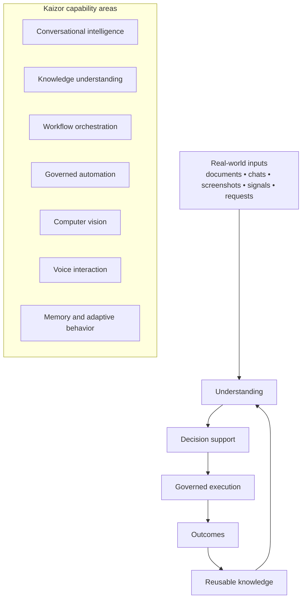
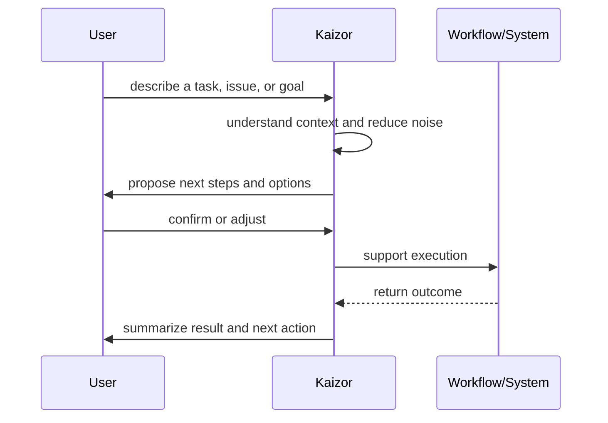
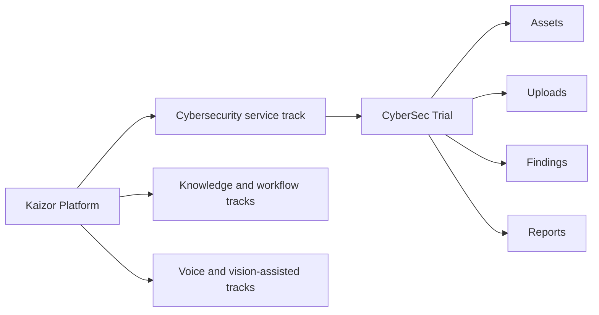

# Kaizor Platform

Kaizor is a general AI platform built for one practical purpose:
helping people and organizations move from **confusion and repetition** to **clarity, control, and meaningful execution**.

Most teams do not fail because they lack tools. They fail because their work is fragmented across too many tools, too many handoffs, too much noise, and too little usable context.

Kaizor is designed to change that.

## What Kaizor solves in the real world

### Work is scattered
Important information lives in documents, chats, dashboards, browser tabs, screenshots, reports, email threads, and human memory.

By the time a decision is made, the context is already broken.

**Kaizor helps by** bringing understanding, decision support, and execution guidance into a single platform experience.

### Teams have more data than they can use
In many organizations, the problem is not lack of information. It is the opposite:
- too many alerts
- too many documents
- too many repeated questions
- too many status updates with too little meaning

**Kaizor helps by** turning messy inputs into usable understanding: summaries, priorities, next steps, and structured outputs.

### Repetition consumes time and attention
Teams repeatedly do the same things:
- explain the same process
- answer the same questions
- rewrite the same updates
- search for the same information
- review the same kinds of issues

**Kaizor helps by** reducing repetitive work while keeping people in control of the decisions that matter.

### Execution breaks when trust is missing
Automation is useful only when people trust it.
Without boundaries, approvals, and visibility, automation creates fear instead of confidence.

**Kaizor helps by** supporting governed execution: safe defaults, approval-sensitive actions, and traceable behavior.

### Knowledge is lost across time
When teams depend on memory, key know-how disappears when people change roles, projects shift, or priorities move.

**Kaizor helps by** preserving useful context, reusable knowledge, and operational patterns so the system becomes more helpful over time.

## What Kaizor is capable of

Kaizor is not a single-purpose feature. It is a multi-capability platform that can support a wide range of workflows.

### Conversational intelligence
Kaizor can support natural, human-centered interaction instead of forcing users into rigid interfaces.

This includes:
- understanding requests and intent
- guiding users through multi-step flows
- providing context-aware answers
- helping users make decisions faster

### Knowledge understanding and retrieval
Kaizor can work with large volumes of information and make them easier to use.

This includes:
- summarizing long inputs
- extracting key points, risks, and action items
- surfacing relevant knowledge when needed
- reducing time spent searching across scattered sources

### Workflow orchestration
Kaizor is designed to support real work, not just answer isolated questions.

This includes:
- guiding users across step-by-step processes
- maintaining context between steps
- reducing workflow friction and handoff loss
- turning repeated patterns into consistent operating flows

### Governed automation
Kaizor can help automate repetitive tasks while preserving human control.

This includes:
- automating low-friction, low-risk operations
- introducing confirmation where impact is higher
- making actions easier to review and trust

### Computer vision and visual understanding
Kaizor can extend beyond text into visual interpretation.

This includes:
- understanding scenes and visual inputs
- interpreting screenshots and visual context
- supporting visual classification and description
- enabling workflows where vision is part of the decision loop

This matters because many real workflows are not text-only. Teams often think through screenshots, interfaces, diagrams, and visual evidence.

### Voice interaction
Kaizor can support voice-first or voice-assisted experiences where that improves usability.

This includes:
- natural spoken interaction
- reduced friction for hands-busy workflows
- broader accessibility for users who prefer voice over typing

### Memory and adaptive behavior
Kaizor is designed to become more useful over time, not less.

This includes:
- retaining operational context
- learning from repeated patterns
- improving continuity in long-running workflows
- helping teams avoid “starting from zero” every time

### Monitoring, safety, and operational control
Kaizor is designed to support serious usage, not just demo interactions.

This includes:
- governed action boundaries
- reviewable behavior
- support for safer execution in real organizational environments

## Where Kaizor can be applied

Because Kaizor is capability-driven rather than tied to a single department, it can be applied across many areas, including:

- cybersecurity operations
- vulnerability management
- internal support workflows
- operational reporting
- document intelligence
- research and analysis
- customer support enablement
- QA and repeatable validation
- knowledge-heavy team workflows

The value comes from the same core principle in every case:
**take fragmented work, recover the context, and make action easier and more trustworthy.**

## Why this matters for organizations

Organizations rarely need “more software” in isolation.
They need systems that:
- reduce noise
- shorten decision cycles
- preserve context
- support safe action
- scale repeated work without scaling chaos

Kaizor is positioned for exactly that problem space.

## How the CyberSec Trial fits into the larger platform

The CyberSec Trial included in this repository is **one service track inside the broader Kaizor platform**.

It is not the whole platform.

It exists to let customers experience one concrete workflow:
- assets
- scan ingestion
- findings review
- status handling
- reporting

This makes the trial useful as a focused evaluation, while the full platform remains broader in scope and capability.

## Visual diagrams

## Platform map

## From problem to action

## Where the trial sits

## In simple terms

Kaizor is built for environments where people are overwhelmed by fragmented information, repeated work, and slow decisions.

Its strength is not in one isolated feature.
Its strength is in combining understanding, workflow support, governed action, and multi-modal capability into one coherent platform.

